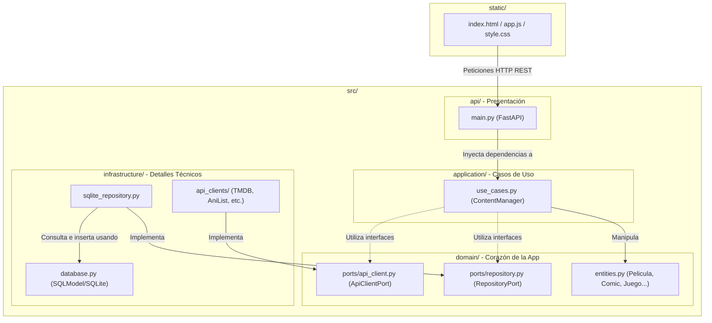
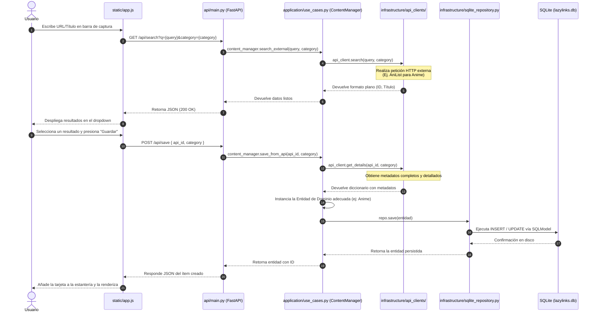

# Arquitectura del Proyecto: LazyList

Este documento describe de manera exhaustiva la organización de carpetas y archivos de **LazyList**, detallando cómo se estructuran tanto el frontend como el backend.

---

## 🏗️ Resumen Arquitectónico

LazyList se implementa bajo los principios de **Clean Architecture (Arquitectura Hexagonal)**. Esto significa que la lógica de negocio (el núcleo del dominio) está aislada de los detalles técnicos de la infraestructura, como la base de datos (SQLite), las APIs externas (TMDB, AniList, etc.) o el propio framework web (FastAPI).

A nivel general, el proyecto se divide en:
1. **Frontend (`static/`)**: Archivos estáticos HTML/JS/CSS de la interfaz del usuario.
2. **Backend (`src/`)**: Lógica en Python dividida en capas limpias de API, Aplicación, Dominio e Infraestructura.
3. **Tests (`tests/`)**: Pruebas automatizadas estructuradas según el tipo de test.

---

## 📂 Mapa Completo del Directorio

A continuación se detalla la estructura física del proyecto en la raíz y dentro del directorio `src/`:

```text
LazyList/
├── .env                    # Variables de entorno locales (API keys y secretos)
├── DESIGN.md               # Especificación del sistema de diseño (Claymorphism)
├── PRODUCT.md              # Especificación funcional y de flujos de producto
├── TODO.md                 # Listado estructurado de tareas y correcciones pendientes
├── README.md               # Guía rápida de instalación y ejecución del proyecto
├── docs/                   # Documentación adicional de soporte
│   ├── arquitectura.md     # [ESTE ARCHIVO] Estructura de carpetas y capas
│   └── como_leer_los_logs.md # Guía para depurar mediante logs y tracebacks
│
├── static/                 # FRONTEND DE LA APLICACIÓN
│   ├── index.html          # Estructura del Single Page App (SPA)
│   ├── app.js              # Lógica de renderizado y llamadas HTTP a la API
│   └── style.css           # Estilos claymórficos generados/compilados
│
├── src/                    # BACKEND DE LA APLICACIÓN
│   ├── api/                # Capa de Presentación
│   │   ├── main.py         # Punto de entrada de FastAPI, enrutamientos y DI
│   │   └── routers/        # Directorio reservado para submódulos de API (actualmente vacío)
│   │
│   ├── application/        # Capa de Aplicación (Casos de Uso)
│   │   ├── use_cases.py    # Orquestación de la lógica (ej. ContentManager)
│   │   └── use_cases/      # Directorio reservado para modularizar casos de uso complejos
│   │
│   ├── domain/             # Capa de Dominio (Entidades y Puertos)
│   │   ├── entities.py     # Modelos SQLModel independientes de negocio (Juego, Libro, etc.)
│   │   └── ports/          # Interfaces abstractas que declaran dependencias del negocio
│   │       ├── api_client.py  # Interfaz requerida para búsqueda externa de metadatos
│   │       └── repository.py  # Interfaz genérica para la persistencia de datos
│   │
│   ├── infrastructure/     # Capa de Infraestructura (Implementaciones Concretas)
│   │   ├── database.py     # Configuración del motor SQLite y sesiones SQLModel
│   │   ├── sqlite_repository.py # Repositorios concretos que implementan RepositoryPort
│   │   ├── api_clients/    # Clientes HTTP concretos que consumen APIs externas
│   │   │   ├── router_client.py  # Enrutador que decide qué API de cliente usar por categoría
│   │   │   ├── anilist_client.py # Cliente para Anime/Manga
│   │   │   ├── tmdb_client.py    # Cliente para Películas/Series
│   │   │   └── ...               # Otros adaptadores (Google Books, IGDB, ComicVine, etc.)
│   │   └── scrapers/       # Scrapers y selectolax para URLs genéricas
│   │
│   └── styles/             # Estilos de Desarrollo
│       └── input.css       # Archivo CSS de entrada para compilar con Tailwind CSS
│
└── tests/                  # SUITE DE PRUEBAS
    ├── unit/               # Tests unitarios rápidos (pruebas a entities y use_cases)
    └── integration/        # Tests de integración lentos (conexiones a DB y llamadas de red)
```

---

## 🎨 1. El Frontend: Su Ubicación e Integración

Una de las preguntas recurrentes al abordar el proyecto es: **¿Dónde se ubica físicamente la interfaz de usuario?**

El frontend de LazyList es una aplicación SPA (Single Page Application) sin frameworks pesados, construida de forma nativa con **Vanilla HTML, JS y CSS (Tailwind)**.

*   **Directorio Físico**: Se ubica en la carpeta [`static/`](file:///c:/Users/aguse/Desktop/Workspace/Proyectos/Web/Apps/LazyList/static) en la raíz del proyecto.
*   **Servicio Estático**: FastAPI monta esta carpeta y sirve los archivos de forma estática en la ruta `/static`. Esto se configura en [`src/api/main.py`](file:///c:/Users/aguse/Desktop/Workspace/Proyectos/Web/Apps/LazyList/src/api/main.py#L72):
    ```python
    app.mount("/static", StaticFiles(directory="static"), name="static")
    ```
*   **Ruta Raíz**: Al entrar a `http://127.0.0.1:8000/`, FastAPI responde directamente sirviendo [`static/index.html`](file:///c:/Users/aguse/Desktop/Workspace/Proyectos/Web/Apps/LazyList/static/index.html) mediante un `FileResponse`:
    ```python
    @app.get("/", include_in_schema=False)
    def index():
        return FileResponse("static/index.html")
    ```
*   **Tailwind CSS**: El archivo [`static/style.css`](file:///c:/Users/aguse/Desktop/Workspace/Proyectos/Web/Apps/LazyList/static/style.css) contiene los estilos definitivos. Se genera a partir de [`src/styles/input.css`](file:///c:/Users/aguse/Desktop/Workspace/Proyectos/Web/Apps/LazyList/src/styles/input.css) usando Tailwind CLI (versión v4), el cual lee las clases directamente del HTML y JS para optimizar el peso del stylesheet.

---

## 📊 2. Diagrama de Capas y Dependencias

La Arquitectura Hexagonal dicta que **las dependencias siempre apuntan hacia adentro**. Las capas externas (como infraestructura o la API) conocen el dominio, pero el dominio nunca conoce detalles de frameworks o bases de datos específicas.

El siguiente diagrama detalla cómo interactúan los componentes en nuestro sistema:



---

## 🔄 3. Ciclo de Vida del Flujo de Datos

Para ilustrar el desacoplamiento de capas, veamos cómo se procesan las dos acciones principales del usuario: **Buscar** un ítem y luego **Guardarlo** en su colección:



---

## 🎯 Conclusión y Buenas Prácticas

Gracias a este esquema limpio:
1.  **Independencia de UI**: Podríamos reemplazar el frontend estático por una app React/Vue o móvil en el futuro, y el backend no cambiaría una sola línea de código.
2.  **Independencia de APIs**: Si una API externa deja de funcionar (ej. ComicVine), solo debemos proveer una nueva implementación en `infrastructure/api_clients` que cumpla con `ApiClientPort`, y el resto del sistema seguirá funcionando sin enterarse.
3.  **Facilidad de Testeo**: Es extremadamente fácil testear los casos de uso (`use_cases.py`) usando mocks de repositorios y APIs externas, ya que dependen de los puertos (interfaces) y no de SQLite o endpoints HTTP reales.
