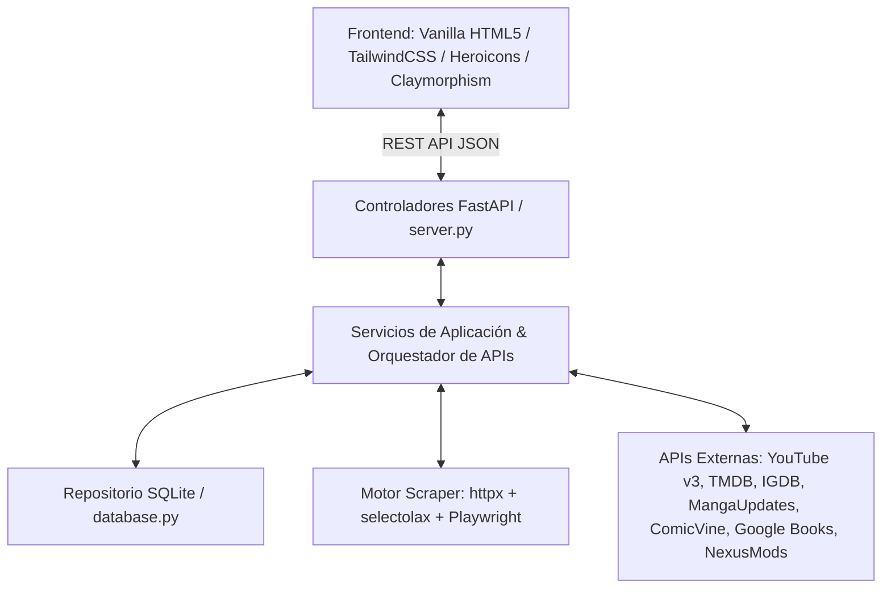

# Master Blueprint & Plan de Desarrollo - LazyLinks Web App

Guía arquitectónica integral y plan de ejecución para la creación desde cero de **LazyLinks Web App**.

---

## 🏗️ 1. Arquitectura General y Metodologías

### Metodologías Principales
- **SDD (Spec-Driven Development)**: Desarrollo guiado por especificaciones arquitectónicas modulares.
- **TDD (Test-Driven Development)**: Creación de la suite de pruebas unitarias e integración (`pytest`) antes de escribir la lógica de producción.
- **Clean Architecture (Hexagonal)**: Desacoplamiento estricto en 4 capas:
  1. **Dominio**: Modelos Pydantic y entidades pura de negocio.
  2. **Servicios**: Casos de uso, orquestación de APIs y motor de scraping.
  3. **Repositorio**: Base de datos SQLite con consultas parametrizadas.
  4. **Controladores**: Rutas REST en FastAPI y Servidor de Frontend.

---

## 🎨 2. Frontend: Sistema de Diseño Claymorphism Puro

### Principios Fundamentales del Claymorphism
1. **Superficies Modeladas Flotantes (Discrete Modeled Surfaces)**:
   - Los elementos **flotan sobre el fondo** oscuro (`#0b0a16`).
   - **Doble Sombra**: Sombra exterior para despegar del fondo + sombra interior (`inset`) que otorga el volumen 3D afelpado.
2. **Geometría Inflada ("Play-Doh / Inflated")**:
   - Bordes redondeados suaves (`rounded-3xl` / 28px+).
   - Padding holgado y volumen "chunky".
3. **Cuerdas de Color Vívidas y Pasteles**:
   - Fondo oscuro profundo (`#0b0a16`), acentos púrpura vibrante (`#8b5cf6`), rosa suave (`#ec4899`), azul pastel (`#60a5fa`).
4. **Tipografía Minimalista y Legible**:
   - Google Fonts **Inter** (Weight 500/700/800) limpia y contrastada.

### Estructura de la Interfaz Web
- **Navegación por Pestañas Superiores**: `Juegos`, `Películas`, `Series`, `Libros`, `Cómics`, `Recursos`.
- **Barra de Búsqueda y Filtros**: Buscador en tiempo real por título, género o autor.
- **Grid de Tarjetas con Portadas (Covers)**: Renderizado de imágenes de portada extraídas de TMDB, AniList, Google Books e IGDB.
- **Modal de Configuración (Settings)**:
  - Interruptor **Ocultar / Mostrar Contenido para Adultos (NSFW)**.
  - Alternador de vista (Grid de Portadas vs Lista Compacta).
  - Limpieza de caché de almacenamiento local (`localStorage`).

---

## ⚙️ 3. Backend & Base de Datos

### Base de Datos Relacional: SQLite (`lazylinks.db`)
- Base de datos relacional local en archivo único.
- **Estrategia de Obtención de Datos (Flujo de 2 pasos)**:
  - Las APIs de búsqueda (ej. TMDB Search) **no** traen todos los datos de golpe (faltan directores, duración, etc.).
  - Flujo: `Búsqueda Interactiva` (el usuario elige de una lista) -> `Fetch Detallado por ID` (llamada extra al endpoint de detalle, ej. `/movie/{id}?append_to_response=credits`) para recolectar la data completa antes de guardar.
  - Para todo lo que no encuentre la API (o no tenga sentido scrapear automáticamente), se habilitará la **Carga Manual**.

- **Esquema de Tablas (Basado en el diseño del usuario)**:
  1. `peliculas`: ID, genre (texto mapeado), title, original_title, release_date, director, duracion, origin_country. (Data: TMDB Search + TMDB Details por ID).
  2. `series`: ID, genre, origin_country, title, original_title, status, premiered, ended, plataform. (Data: TMDB TV + TvMaze).
  3. `anime`: ID, title_english, title_romaji, episodios, status, genre, premiered, ended. (Data: AniList. Premiered/Ended salen de `startDate` y `endDate`).
  4. `mangas`: ID, title_english, title_romaji, status, year, autor, capitulos. (Data: AniList + MangaDex para autor).
  5. `comics` (Manual): ID, title, year, publisher, capitulos, genero, escritor, status.
  6. `novelas` (Manual): ID, title, year, capitulos, genero, escritor, status.
  7. `libros`: ID, titulo, autor, año, genero, saga, orden. (Data: Google Books).
  8. `recursos` (Manual): ID, titulo, url, creado_autor, volver_a_ver, notas, tipo, NSFW.
  9. `juegos` (Manual): ID, titulo, mod, tienda, estado.
  10. `generos`: Tabla de homologación para mapear los IDs de TMDB y otras APIs a nombres de género unificados en nuestra BD.

### Backend Framework: FastAPI (Python 3.14)
- **Rutas REST**:
  - `GET /api/items/{category}`: Listar ítems por categoría.
  - `POST /api/process`: Procesar URL o texto (consulta APIs + Scraping + Guarda en DB).
  - `DELETE /api/items/{category}/{id}`: Eliminar un recurso.
  - `GET /api/settings` & `POST /api/settings`: Leer y actualizar preferencias.

### Motor de Scraping e Integraciones
- **Webs Estáticas**: `httpx` + `selectolax` (Parseo en C ultrarrápido).
- **Webs Dinámicas (JS)**: `Playwright async` (Navegador Headless).
- **YouTube**: `YouTube Data API v3` oficial.
- **Estrategia Anti-Frágil**: Extracción prioritaria de metaetiquetas **OpenGraph** (`og:title`, `og:site_name`, `og:author`) y datos estructurados **JSON-LD**.

---

## 🔒 4. Ciberseguridad y Buenas Prácticas

1. **SQL Injection**: Uso exclusivo de consultas parametrizadas (`cursor.execute("SELECT ... WHERE id = ?", (item_id,))`).
2. **Cross-Site Scripting (XSS)**: Escapado automático de cadenas HTML en el frontend JS y validación con Pydantic.
3. **CORS & Security Headers**: Configuración de middleware CORS seguro en FastAPI.
4. **Git Workflow**: Commits usando estándar **Conventional Commits** (`feat:`, `fix:`, `refactor:`, `docs:`).

---

## 🚀 5. Hoja de Ruta de Ejecución (Paso a Paso)

1. **Paso 1**: Estructura de carpetas (`static/`, `tests/`, `server.py`, `database.py`, `scraper.py`).
2. **Paso 2**: Pruebas unitarias de base de datos SQLite y endpoints API (`pytest`).
3. **Paso 3**: Servidor FastAPI y lógica de orquestación de APIs externas.
4. **Paso 4**: Maquetación HTML5 + CSS Claymorphic Pure (`style.css` con doble sombra `inset`/`outset`).
5. **Paso 5**: Integración JS (`app.js`) para interacción dinámica, modales y portadas visuales.
